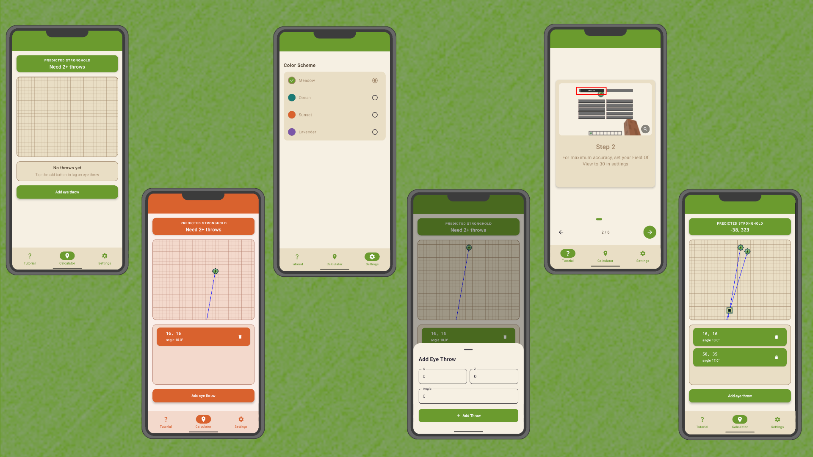
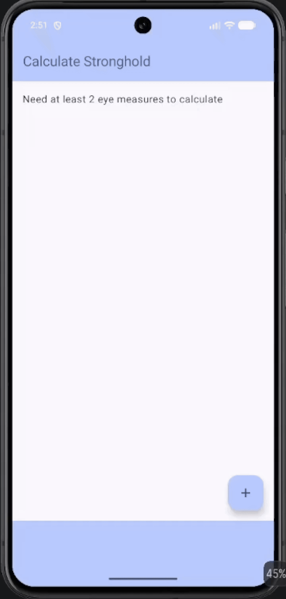
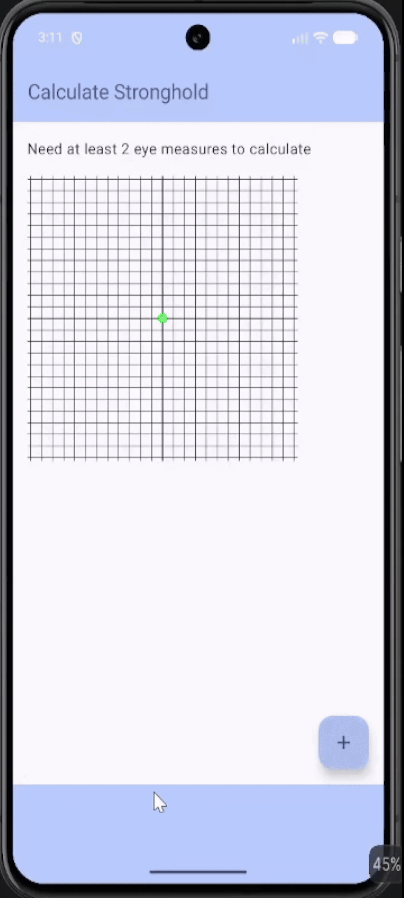
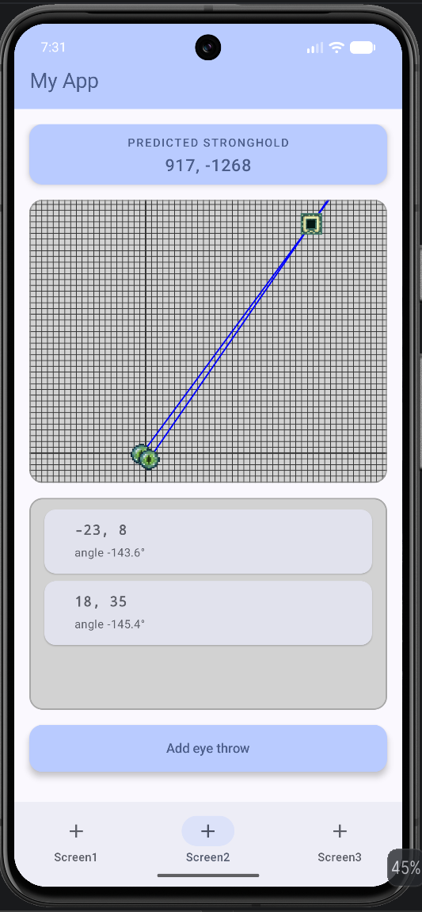

# Minecraft Stronghold Calculator

_An Android app that assists users in finding a stronghold in Minecraft._

[Download APK](#try-it) • [Demo Video](#demo-video) • [Version History](#version-history)

Players find a stronghold by throwing Eyes of Ender to determine its direction. Eyes are difficult to obtain and have a chance of breaking each throw, while the average journey uses 5+ throws. Given the large distance between strongholds, players also have trouble pinpointing their exact location without a sophisticated tool. 

## How It Works

- Record each Eye of Ender throw using your position and throw angle.
- The app plots each throw as a vector on an interactive map.
- Multiple throws are used to calculate their intersection and predict the stronghold's location.
- Remove inaccurate throws or use the calculator to locate another stronghold.

[Mathematical Approach](#mathematical-approach)

## Features

- **Stronghold Calculator** — Calculate a stronghold's location from multiple Eye throws.
- **Interactive Map** — Visualize throw vectors and the calculated intersection.
- **Throw Management** — Add or remove individual throws.
- **Guided Tutorial** — Learn how to use the calculator step-by-step.
- **Custom Themes** — Personalize the app's appearance.

## Demo Video

[Watch the Demo Video](https://www.youtube.com/watch?v=A3bWUoZF3jc)

## Tech Stack

- Kotlin
- Jetpack Compose
- Android SDK
- Material 3

## Mathematical Approach

WIP fam

## Future Improvements

- Add error/uncertainty visualization
- Support for 3+ throws using linear regression
- Update map visuals (coordinate labels/clamping markers)
- Each eye input updates map offset
- Publish to Google Play

## Try it

### Requirements

- Android 7.0+ (Nougat)

### Installation

1. Download the APK from a browser on your Android device
2. Open APK
3. Tap install

[Download APK](../../releases/latest)

## Building From Source

### Requirements

- Android Studio
- Android SDK
- Kotlin

### Installation

1. Clone the repository
2. Open the project in Android Studio
3. Sync Gradle
4. Build and run on an emulator or Android device

## Version History

### Initial Prototype

### Added Interactive Map

### Added Pages, Cleaner Jetpack Compose UI

### Updated Color Scheme, Polished UI

